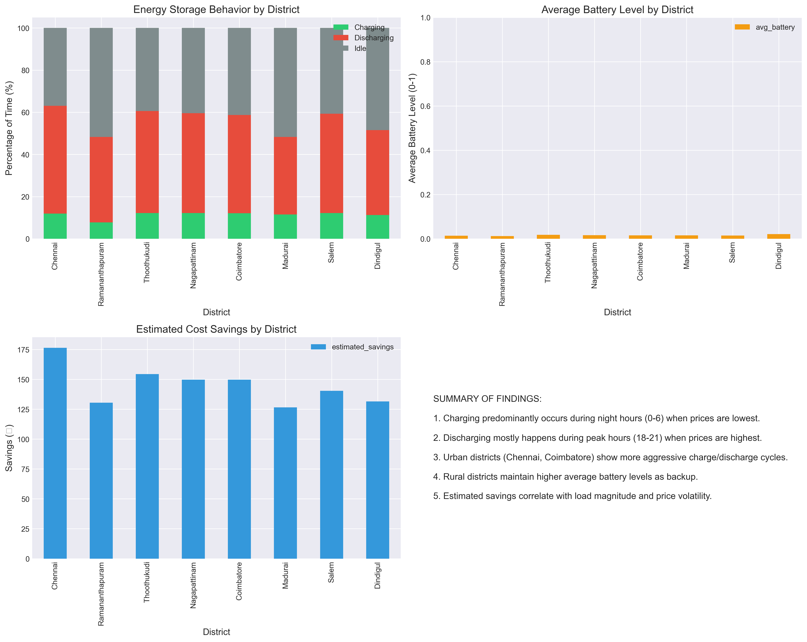
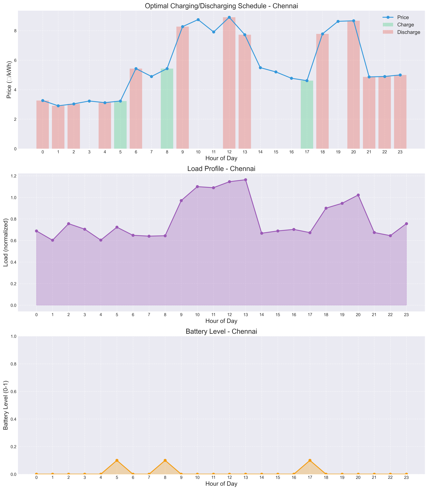

# Energy Optimization Platform for Tamil Nadu

This repository contains a suite of tools and applications for optimizing renewable energy potential and storage in Tamil Nadu, India. The platform leverages AI, data science, and modern web technologies to forecast renewable energy, optimize storage, and provide interactive visualizations.

## Project Structure

- **Frontend/**: Modern React-based web interface for e-commerce demonstration.
- **Charge/**: Streamlit app for optimizing energy storage using Reinforcement Learning across Tamil Nadu districts.
- **Energy Potential/**: Streamlit app for forecasting renewable energy (wind, solar, ocean) potential using machine learning.

## Features

- **Energy Storage Optimization**: RL-based charge/discharge scheduling for multiple districts.
- **Renewable Energy Forecasting**: ML-based forecasts for wind, solar, and ocean energy.
- **Interactive Visualizations**: District-wise comparison, daily/hourly patterns, and optimal schedules.
- **Modern Web Frontend**: Responsive e-commerce demo (ShopEasy) built with React.

## Example Visualizations

### Energy Storage Optimization


*District-level summary statistics for energy storage optimization.*


*Optimal charge/discharge schedule for Chennai.*

### Renewable Energy Potential


*Average hourly renewable energy pattern for Chennai.*


*Comparison of total wind, solar, and ocean energy potential across districts.*

## Getting Started

### Prerequisites

- Python 3.8+
- Node.js (for Frontend)
- pip (for Python dependencies)

### Installation

1. **Clone the repository:**
   ```bash
   git clone <repo-url>
   cd <repo-folder>
   ```

2. **Install Python dependencies:**
   ```bash
   pip install -r requirements.txt
   ```

3. **Frontend setup:**
   ```bash
   cd Frontend
   npm install
   npm start
   ```

4. **Run Streamlit apps:**
   - For energy storage optimization:
     ```bash
     cd ../Charge
     streamlit run app.py
     ```
   - For energy potential forecasting:
     ```bash
     cd ../Energy\ Potential
     streamlit run app.py
     ```

## Technologies Used

- Python, Streamlit, Pandas, NumPy, Matplotlib, Seaborn, Plotly
- React, Styled Components, React Router (Frontend)
- Machine Learning, Reinforcement Learning

## License

This project is licensed under the MIT License. See [LICENSE](LICENSE) for details.
